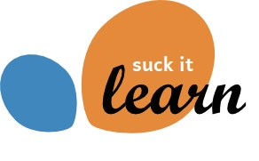

Add one for the sklearn library that implements new methods such as kenrel regression, super-learner framework, SOM clustering besides a few that are already implemented in the standard framework but I implemented on my own.

## Installation

You can install the kernel regression module using pip:

    pip install sucklearn
